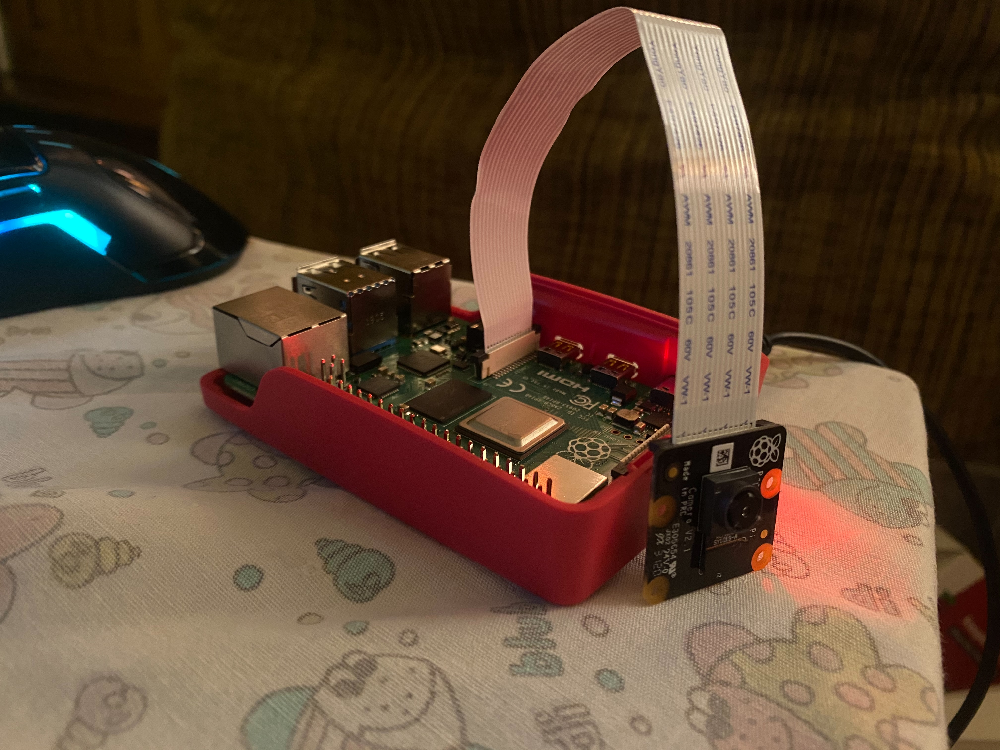

# Face Detector
ตรวจจับใบหน้าคนด้วย Raspberry pi และ python 3



## Tools :memo:
• Raspberry pi
• Camera module
• Python 3


## Installation: :computer:
```ruby
# Enable Camera 4
• sudo raspi-config 
• Interface option
• 'Camera' option 
• Enter key to enable camera 
• Choose“Finish” 
• And reboot your Raspberry Pi.

# Install Libary
• sudo apt-get update
• sudo apt-get upgrade
• sudo apt-get install build-essential
• sudo apt-get install cmake
• sudo apt-get install gfortran
• sudo apt-get install git
• sudo apt-get install wget
• sudo apt-get install curl
• sudo apt-get install graphicsmagick
• sudo apt-get install libgraphicsmagick1-dev
• sudo apt-get install libatlas-base-dev
• sudo apt-get install libavcodec-dev
• sudo apt-get install libavformat-dev
• sudo apt-get install libboost-all-dev
• sudo apt-get install libgtk2.0-dev
• sudo apt-get install libjpeg-dev
• sudo apt-get install liblapack-dev
• sudo apt-get install libswscale-dev
• sudo apt-get install pkg-config
• sudo apt-get install python3-dev
• sudo apt-get install python3-numpy
• sudo apt-get install python3-pip
• sudo apt-get install zip
• sudo apt-get install python3-picamera
• sudo pip3 install --upgrade picamera[array]
• pip3 install dlib
• pip3 install numpy
• pip3 install scikit-image
• sudo apt-get install python3-scipy
• sudo apt-get install libatlas-base-dev
• sudo apt-get install libjasper-dev
• sudo apt-get install libqtgui4
• sudo apt-get install python3-pyqt5
• sudo apt install libqt4-test
• pip3 install opencv-python==3.4.6.27
• pip3 install face_recognition 
```

## How to run 
• cd ./face_recognition/examples && python3 facerec_on_raspberry_pi.py

## Result


